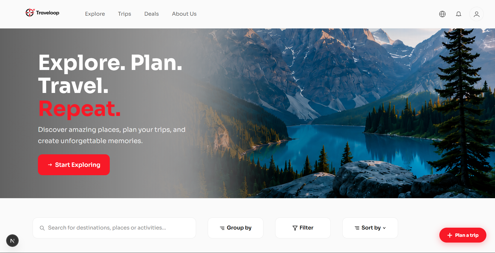

# 🌍 Traveloop – Personalized Travel Planning Made Easy



## Vision & Mission
**Traveloop** is an intelligent, collaborative platform designed to transform how individuals plan and experience travel. Our mission is to simplify multi-city travel planning, allowing users to dream, design, and organize their journeys with ease. From exploring global destinations to managing budgets and sharing itineraries, Traveloop makes the planning process as exciting as the trip itself.

---

##  Key Features

### Trip Planning & Management
- **Dashboard:** A central hub for upcoming trips, popular cities, and quick actions.
- **Create Trip:** Easily initiate new trips with names, dates, and descriptions.
- **My Trips:** A dedicated view to manage all your personal travel itineraries.
- **Itinerary Builder:** An interactive interface to add cities, dates, and activities per stop.
- **Itinerary View:** Visualize your journey through structured timelines and grouped city views.

### Discovery & Personalization
- **City & Activity Search:** Browse destinations and activities with metadata like cost, popularity, and category.
- **Trip Notes & Journal:** Capture important details, hotel info, or daily memories directly within your trip.
- **Packing Checklist:** Stay organized with a per-trip checklist for essentials like documents and electronics.

### Budget & Sharing
- **Budget Breakdown:** Real-time financial summaries with cost analysis by category (transport, meals, activities).
- **Public Itineraries:** Share your travel plans via public URLs for inspiration or community copying.
- **User Profile:** Manage personal preferences, saved destinations, and account settings.

###📊 Admin & Analytics (Optional)
- **Admin Dashboard:** Track platform usage, popular destinations, and user engagement trends.

---

## Tech Stack

- **Frontend:** [Next.js](https://nextjs.org/) (React Framework)
- **Backend:** [Node.js](https://nodejs.org/) & [Express](https://expressjs.com/)
- **Database:** [PostgreSQL](https://www.postgresql.org/)
- **ORM:** [Prisma](https://www.prisma.io/)
- **Design:** [Excalidraw Mockup](https://link.excalidraw.com/l/65VNwvy7c4X/22o30WE3bE4)

---

## Getting Started

### Prerequisites
- Node.js (v18+)
- PostgreSQL Database

### Installation
1. **Clone the repository:**
   ```bash
   git clone https://github.com/Nishant0p/Odoo-Hackathon.git
   ```

2. **Setup Frontend:**
   ```bash
   cd traveloopfrontend
   npm install
   npm run dev
   ```

3. **Setup Backend:**
   ```bash
   cd ../traveloopbackend
   npm install
   # Configure your .env with DATABASE_URL
   npx prisma generate
   npx prisma db push
   npm start
   ```

---

*Made with ❤️ for the Odoo Hackathon*
